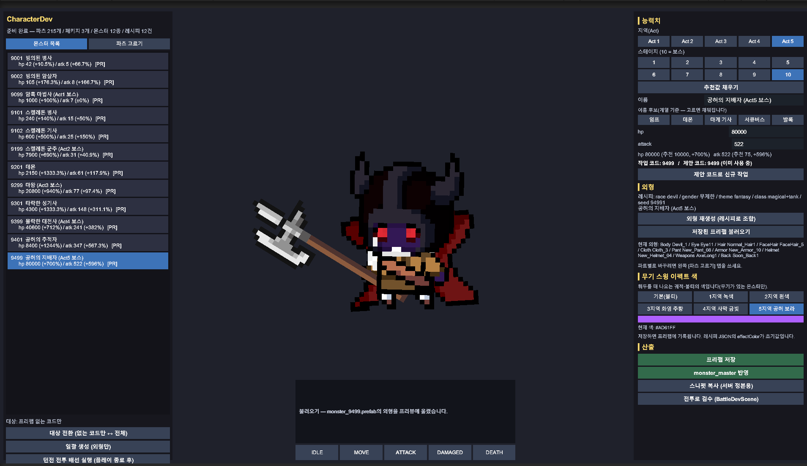

# 몬스터 자동 생성 (`master-monster` 스킬)

> **말 한 줄로 몬스터를 만들어 실제 전투에 등장시킨다.**
> 정본: [`.claude/skills/master-monster/SKILL.md`](../.claude/skills/master-monster/SKILL.md)

---

## 1. 무엇을 하는가

```
"5-10 스테이지 보스로 등장할 '공허의 지배자' 몬스터를 만들어줘"
                          ↓
        능력치 · 외형 · 프리팹 · 스테이지 배치 · 전투 배선 · 클라 번들
                          ↓
                   게임에서 바로 등장
```

몬스터 한 종을 넣으려면 원래 **6곳**을 사람이 직접 맞춰야 했다. 이 스킬은 그 전부를 한 번의 요청으로 처리한다.

| 손대야 했던 곳 | 무엇 |
|---|---|
| `master-data-값.md` §9 | 몬스터 표 + 「규모/현황」 문장 |
| `master-data-schema.sql` | `monster_master` INSERT + 머리 주석 |
| `master-data-값.md` §11 · `schema.sql` | `stage_spawn` (어느 스테이지에 몇 마리) |
| `monster-appearance-recipe.json` | 외형 레시피 |
| `Assets/Prefabs/Character/Monster/` | `monster_{code}.prefab` |
| `GameScene` | 코드 → 프리팹 맵(던전 전투 배선) |

---

## 2. 처리 흐름

```
① 입력 해석 → ② 능력치·외형 결정 → ③ 정본 + 스폰 반영 → ④ 프리팹 생성 → ⑤ 전투 배선 → ⑥ 번들 재생성 → ⑦ 검증
                     └────────── 도구(CLI) ──────────┘   └─── Unity 에디터 ───┘   └ CLI ┘
```

- **능력치는 계산해서 낸다** — 지역(Act)·스테이지를 넣으면 기존 12종을 앵커로 한 기하 보간식으로 `hp`·`attack`이 나온다. 클라이언트 `MonsterStatCurve`와 **같은 산식**이라 씬에서 보는 추천값과 정확히 일치한다.
- **외형은 태그로 조합한다** — `race`(undead·devil·human…) + `class`(melee·magical·tank…)로 SPUM 파츠 215개에서 골라 조립한다. 같은 시드면 같은 결과가 나와 **재현된다**.
- **순서가 핵심** — 번들 재생성은 `schema.sql → DB → 클라 번들` 단방향이라, 정본을 먼저 맞추지 않으면 앞선 작업이 덮어써진다. 스킬이 이 순서를 강제한다.

---

## 3. 데모

### 3-1. 명령 한 줄 → 전 과정 자동 실행


요청을 해석해 코드를 채번하고, 능력치를 산출하고, 정본 세 파일과 스폰 테이블을 갱신한 뒤, Unity에서 프리팹을 만들고 전투에 배선하기까지가 한 흐름으로 이어진다. *(2.4배속)*

### 3-2. 외형 자동 결정 결과



`CharacterDevScene`에서 생성 결과를 확인하는 화면이다.

- **좌측** — 몬스터 12종 목록. 각 항목에 `hp`·`atk`와 **추천값 대비 편차**(`±0%`, `+65.8%`)가 함께 표시돼 밸런스 이탈을 바로 알 수 있다.
- **우측 상단** — Act 5 · 스테이지 10(보스) 선택 → `hp 10000` / `attack 75`가 자동으로 채워졌고, 추천 대비 `±0%`로 표시된다.
- **우측 중단** — 확정된 외형 레시피와 실제로 조합된 파츠 목록
  `race devil / theme fantasy / class magical+tank / seed 94991`
  `Body Devil_1 · Helmet New_Helmet_04 · Armor New_Armor_10 · Back Soon_Back1 …`
- **중앙** — 그 레시피로 만들어진 `monster_9499.prefab`(공허의 지배자). 큰 뿔 투구·어두운 갑옷·붉은 눈.

### 3-3. 인게임 적용


생성한 몬스터가 지정한 지역·스테이지에서 **실제로 스폰되어 전투에 참여**한다. 별도의 수동 배선이나 데이터 입력 없이 곧바로 반영된다. *(2배속)*

---

## 4. 이렇게 요청하면 된다

| 요청 예시 | 동작 |
|---|---|
| "언데드 궁수 몬스터 만들어줘. 2지역 5스테이지에 4마리" | 신규 생성 + 배치 + 전투 등장까지 |
| "5-10 스테이지 보스로 '공허의 지배자' 만들어줘" | 보스 코드(`xx99`)로 채번, 보스 능력치 적용 |
| "5스테이지 스켈레톤 병사 3마리 더 넣어줘" | 배치만 조정(증분) |
| "이 몬스터 외형을 검은 투구에 어두운 느낌으로 바꿔줘" | **능력치는 그대로 두고** 외형만 교체 |
| "외형이 마음에 안 들어, 다시 뽑아줘" | 시드만 옮겨 재조합 |

요청 종류에 따라 **필요한 단계만** 실행한다. 예를 들어 외형 교체는 서버 정본·DB·번들을 건드리지 않으므로 프리팹만 다시 만든다.

---

## 5. 안전장치

작업 후 `verify`가 자동으로 돌아 **정본 간 불일치**를 잡는다.

| 검사 | 예 |
|---|---|
| 문서 ↔ SQL 일치 | 값 문서 표와 `INSERT`의 코드·이름·`hp`·`attack`이 어긋남 |
| 코드 규약 | Act 대역(`90xx`~`94xx`)·보스 `xx99` 위반 |
| 집계 문장 | 「12종(일반 7 + 보스 5)」 같은 요약이 실제 개수와 다름 |
| 참조 무결성 | `stage_spawn`에 없는 몬스터나 보스가 들어감 |
| **전투 등장 여부** | 만들어 놓고 **어느 스테이지에도 배치되지 않음** |
| 밸런스 | 스테이지 총 마리 수가 통상 범위(8~16)를 벗어남 |

프리팹은 저장 직후 **3항목**(루트 `SPUM_Prefabs` · `_anim` 배선 · 상태별 애니메이션 클립)을 검증하고, 실패하면 자동으로 백업본을 되돌린다. 기존 프리팹은 교체 전 `Assets/Dev/MonsterPrefabBackup/`에 남는다.

---

## 6. 요약

- **입력 한 줄 → 실제 전투 등장까지.** 중간에 사람이 Unity를 조작하는 단계가 없다.
- **정본이 갈라지지 않는다.** 문서·SQL·레시피·번들을 한 도구가 동시에 맞추고 매번 검증한다.
- **조합 규칙은 한 곳에만 있다.** 개발 씬과 자동 빌더가 같은 코드(`MonsterUnitFactory`)를 쓰므로 손으로 만든 것과 자동 생성한 것이 같은 결과를 낸다.

전제 조건은 두 가지다 — **Unity 에디터 실행 중**(프리팹·배선), **MySQL 실행 중**(번들 재생성). 둘 중 하나가 없으면 그 지점에서 멈추고 무엇이 남았는지 알린다.
